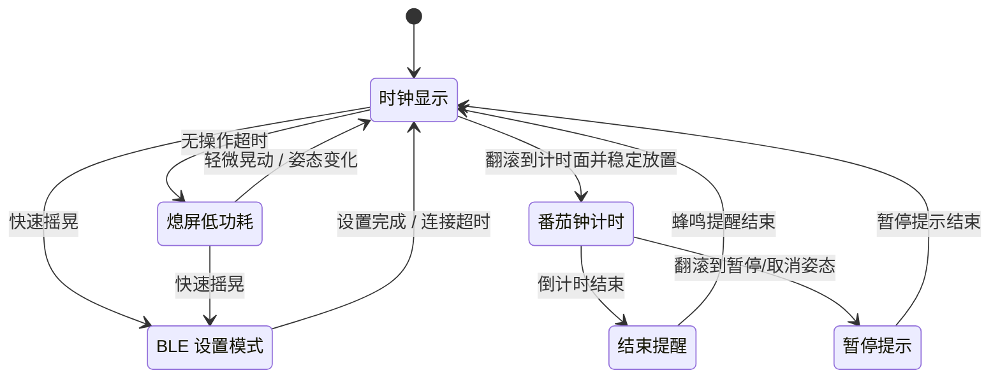

## 1. 设备设计

### 1.1 目标

本项目制作一个小型立方体番茄钟。设备顶面放置小尺寸单色 OLED 屏幕，用于显示当前时间、倒计时、电量和状态。与顶面相邻的四个侧面均可作为接触桌面的“底面”，用户通过翻滚立方体 90° 启动或切换计时状态。

设备不设置实体按钮，主要依赖姿态变化和摇晃动作交互。外壳面向 3D 打印设计，预留 Type-C 充电口，内部结构便于拆卸、调试和后续缩小体积。

### 1.2 交互与功能

设备默认处于时钟状态，屏幕显示当前时间和电量。长时间无操作后，OLED 熄灭，设备进入低功耗状态。轻微晃动或姿态变化会重新点亮屏幕。

立方体翻滚到指定侧面并稳定放置后，开始一次番茄钟计时，默认 25 分钟。计时过程中，屏幕显示剩余时间。计时结束后，蜂鸣器提醒，并显示结束状态，随后返回时钟状态。

计时过程中检测到暂停/取消姿态时，设备暂停当前计时，短暂显示暂停提示后回到时钟状态。

快速摇晃用于进入 BLE 设置模式。一般情况下 BLE 关闭，只有快速摇晃触发后短时间开启。手机连接后设置当前时间、默认番茄钟时长、蜂鸣提醒方式、屏幕熄灭时间等参数。设置完成或连接超时后关闭 BLE。

### 1.3 硬件方案

主控使用 ESP32-C3，开发环境为 PlatformIO + Arduino framework。ESP32-C3 负责读取传感器、驱动屏幕、控制蜂鸣器，并通过 BLE 与手机通信。

屏幕使用 SSD1327 单色 OLED。OLED 采用黑底白字显示，没有 TFT 背光常亮问题，适合电池供电设备。第一版只要求清晰显示时间、电量、倒计时和状态提示。

姿态检测使用 SC7A20H 三轴加速度传感器，通过 I2C 与 ESP32-C3 通信。第一阶段使用轮询读取三轴数据，调试六面识别、稳定放置判断、轻微晃动唤醒和快速摇晃检测。后续使用 INT 引脚做低功耗运动中断唤醒。

提醒部分使用 12085 蜂鸣器，阻抗约 16Ω。蜂鸣器通过 MOSFET 或三极管由 GPIO 控制。若使用无源蜂鸣器，ESP32-C3 输出 PWM；若使用有源蜂鸣器，GPIO 只控制开关。

电池使用小型单节聚合物锂电池。充电接口为 Type-C，充电电路使用单节锂电充电保护方案。系统电源可先采用电池升压到 5V 后接 ESP32-C3 开发板，也可后续改为电池经 3.3V 稳压/升降压后直接供电。电量检测第一版使用电阻分压接 ADC，后续可改用 MAX17048 电量计。

### 1.4 低功耗策略

静息状态下关闭 OLED，ESP32-C3 进入低功耗模式，BLE 默认关闭，SC7A20H 保持低功耗运动检测。检测到运动后唤醒主控，再读取完整三轴数据并判断动作类型。

低功耗逻辑的核心是：屏幕不常亮，BLE 不常开，ESP32-C3 不长期高频轮询。第一版先验证功能，后续再优化中断唤醒和静态电流。

### 1.5 第一版范围

第一版验证核心功能，不追求极致小体积和最终外观。目标包括：OLED 显示时间、电量和倒计时；SC7A20H 识别六个方向；翻滚启动 25 分钟计时；翻滚暂停；计时结束蜂鸣提醒；快速摇晃进入 BLE 设置；BLE 设置基础参数；无操作熄屏；晃动唤醒。

第一版外壳先使用较大的 3D 打印结构，优先保证安装、拆卸、测量和调试方便。功能稳定后再优化内部布局、屏幕开窗、接口位置和整体尺寸。

## 2. 电源实验与 PCB 流程

### 2.1 当前电源实验路线

电源部分分两条路线推进。第一条路线使用现成 TP4056 模块做整机功耗测试。模块到货后测量原始静态电流，再拆除指示灯和相关限流电阻，重新测量空载和带载电流，用来判断该模块是否适合第一版原型。

第二条路线使用 LR4054 + AP2112K 画实验板。LR4054 负责单节锂电池充电，AP2112K 输出 3.3V，为 ESP32-C3、OLED 和 SC7A20H 供电。该方案避免电池先升压到 5V 再降压到 3.3V 的损耗，更接近最终低功耗结构。

已购入 LR4054、AP2112K、2112K 相关器件和 SOT23-6 转直插转接板。转接板用于前期焊接和面包板验证，降低直接画 PCB 的风险。

### 2.2 实验板目标

第一版电源实验板只验证基础电源链路。板上保留 USB Type-C 输入、电池接口、LR4054 充电部分、AP2112K 3.3V 稳压部分、3.3V 输出排针、GND 排针、充电状态引脚和测试点。

测试点至少覆盖 `VUSB`、`VBAT`、`3V3`、`GND` 和充电状态信号，方便用万用表测量输入电压、电池电压、稳压输出和静态电流。

### 2.3 EDA 页面用途

工程页面用于管理整个 PCB 项目，包括原理图、PCB、元件库、封装库、BOM 和 Gerber 输出文件。

原理图页面用于画电路连接关系。当前实验板重点是 USB 输入、LR4054、电池、AP2112K、3.3V 输出和测试点。网络名保持清楚，例如 `VUSB`、`VBAT`、`3V3`、`GND`。

元件符号页面用于管理原理图符号。符号重点是引脚编号和功能名称，必须和数据手册一致。

封装页面用于管理真实焊盘尺寸和引脚位置。LR4054、AP2112K 这类 SOT-23 系列器件需要核对具体封装和 1 脚方向。第一版实验板优先保证可手焊，焊盘和器件间距不压缩。

PCB 页面用于摆放器件、走线、铺铜和定义板框。USB Type-C 放在板边，电池接口靠近充电芯片，输入输出电容靠近芯片引脚，电源线宽度大于普通信号线，GND 使用铺铜。

3D 预览用于检查接口方向、器件高度、排针朝向和板子外形。后续整机 PCB 需要配合外壳检查空间干涉。

BOM 页面用于记录器件型号、参数、封装、数量和采购信息。实验失败时通过 BOM 回查器件型号、阻值、电容值和封装选择。

Gerber 页面用于导出打样文件。导出前检查板框闭合、层数正确、钻孔文件存在、线宽线距符合板厂常规工艺。

### 2.4 绘制顺序

先画 LR4054 充电部分，再画 AP2112K 3.3V 稳压部分。随后添加 USB Type-C、电池接口、3.3V 输出、GND、状态引脚和测试点。完成原理图后核对封装，进入 PCB 页面布局走线。最后运行 ERC 和 DRC，确认无明显错误后导出 Gerber。

第一版板子保留调试空间，丝印标清网络名称和接口方向。目标是验证电路和熟悉 PCB 流程，不压缩面积。
